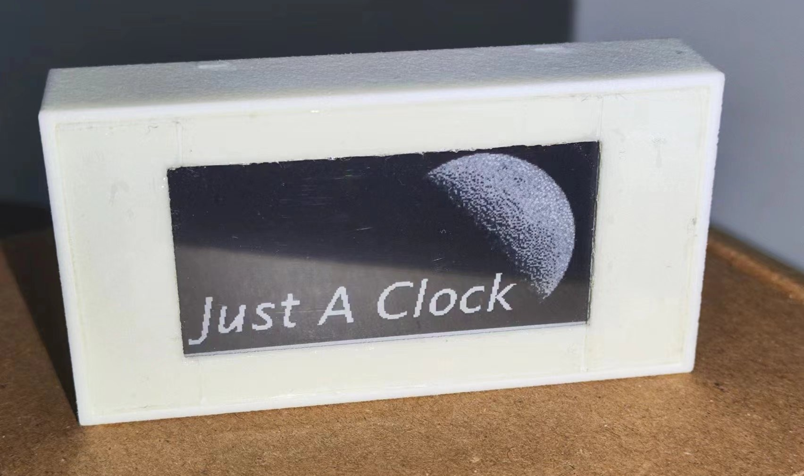
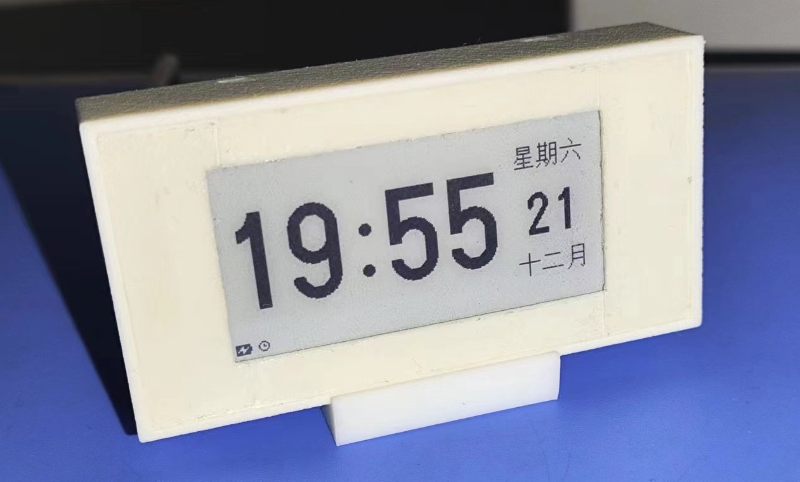

# Just A Clock




## How to compile

1. goto source directory

```
$ cd fw
```

2. compress web source file

```
$ cd spiffs_image
$ gzip -9 *
$ cd ..
```

3. build project

```
$ idf.py build
```

4. generate resources

```
$ # output is build/res/res.bin
$ ./tools/genres.sh
```

5. generate OTA file (optional)

```
$ # output is build/JAC_ota.bin
$ ./tools/genota.sh
```

6. flash

```
$ # resources and web archives must flash with app
$ python -m esptool --chip esp32c3 -b 460800 --before default_reset --after hard_reset write_flash --flash_mode dio --flash_size 4MB --flash_freq 80m 0x0 build/bootloader/bootloader.bin 0x8000 build/partition_table/partition-table.bin 0xd000 build/ota_data_initial.bin 0x90000 build/JAC.bin 0x380000 build/storage.bin 0x10000 build/res/res.bin
```

You can use the file generated in __step 5__ to update the firmware through OTA.
